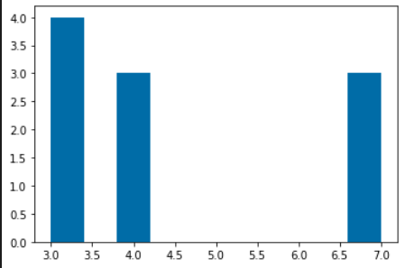
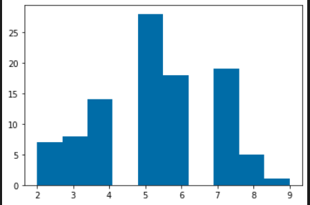
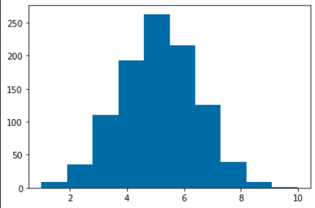
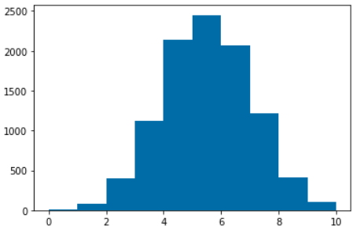
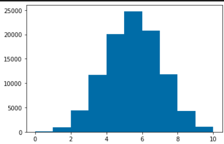

# Demonstration of the law of large numbers

### Binomial Distribution N = 10

### Binomial Distribution N = 100

### Binomial Distribution N = 1000

### Binomial Distribution N = 10000

### Binomial Distribution N = 100000

### Analysis
As can be seen by the above graphs, as N increases, the binomial distribution begins to approach the shape of the normal distribution. As N increases, a bell shape curve becomes more defined.